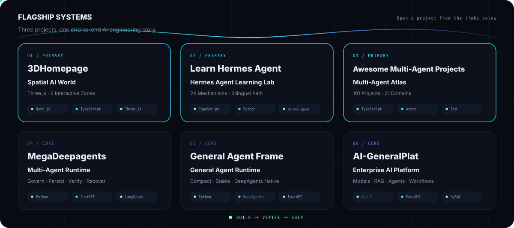
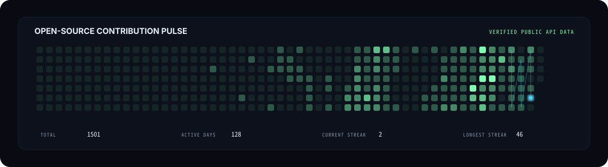

<a href="README.md"><kbd>简体中文</kbd></a>

<picture>
  <source media="(prefers-color-scheme: dark)" srcset="assets/generated/hero-en-dark.svg">
  <source media="(prefers-color-scheme: light)" srcset="assets/generated/hero-en-light.svg">
  
</picture>

  <a href="https://github.com/xxiaoxiong/awesome-multi-agent-projects"><strong>🧭 Explore the Multi-Agent Atlas</strong></a>
  &nbsp;&nbsp;·&nbsp;&nbsp;
  <a href="https://github.com/xxiaoxiong/MegaDeepagents"><strong>⚙️ View the Flagship Runtime</strong></a>
  &nbsp;&nbsp;·&nbsp;&nbsp;
  <a href="https://3-d-homepage.vercel.app/"><strong>🌐 Enter the 3D Portfolio</strong></a>

## Start Here

| Your goal | Recommended entry | What you will find |
|---|---|---|
| **Discover multi-agent projects and compare approaches** | [Awesome Multi-Agent Projects](https://github.com/xxiaoxiong/awesome-multi-agent-projects) | A bilingual, domain-first atlas of open-source multi-agent systems |
| **Evaluate my engineering depth** | [MegaDeepagents](https://github.com/xxiaoxiong/MegaDeepagents) | A governed, recoverable, and verifiable multi-agent task runtime |
| **Explore my work quickly** | [3DHomepage](https://github.com/xxiaoxiong/3DHomepage) | An interactive 3D portfolio of AI engineering projects |

> If one of these projects helps you, a Star on its repository is appreciated. Issues, usage feedback, and improvement ideas are welcome too.

## Core Projects · Complete Map

<picture>
  <source media="(prefers-color-scheme: dark)" srcset="assets/generated/project-showcase-en-dark.svg">
  <source media="(prefers-color-scheme: light)" srcset="assets/generated/project-showcase-en-light.svg">
  
</picture>

| [**01 · 3DHomepage**](https://github.com/xxiaoxiong/3DHomepage) | [**02 · Learn Hermes Agent**](https://github.com/xxiaoxiong/learn-hermes-agent) | [**03 · Awesome Multi-Agent Projects**](https://github.com/xxiaoxiong/awesome-multi-agent-projects) |
|:---:|:---:|:---:|
| [**04 · MegaDeepagents**](https://github.com/xxiaoxiong/MegaDeepagents) | [**05 · General Agent Frame**](https://github.com/xxiaoxiong/general-agent-frame) | [**06 · AI-GeneralPlat**](https://github.com/xxiaoxiong/AI-GeneralPlat) |

## Capability Orbit

<picture>
  <source media="(prefers-color-scheme: dark)" srcset="assets/generated/capability-orbit-en-dark.svg">
  <source media="(prefers-color-scheme: light)" srcset="assets/generated/capability-orbit-en-light.svg">
  
</picture>

## Open-Source Pulse

<picture>
  <source media="(prefers-color-scheme: dark)" srcset="assets/generated/contribution-swarm-en-dark.svg">
  <source media="(prefers-color-scheme: light)" srcset="assets/generated/contribution-swarm-en-light.svg">
  
</picture>

<strong>View merged external contributions</strong>

| Repository / PR | Contribution | Field |
|---|---|---|
| [nexu-io/open-design #6773](https://github.com/nexu-io/open-design/pull/6773) | Fix workspace-scoped MCP resources/list and resources/read (#6770) | Engineering |
| [nexu-io/open-design #6736](https://github.com/nexu-io/open-design/pull/6736) | fix(cli): make `od project list` honor the signed-in workspace (#6679) | Engineering |
| [CherryHQ/cherry-studio #18117](https://github.com/CherryHQ/cherry-studio/pull/18117) | fix(backup): skip EBUSY locked files (LevelDB LOCK) during automatic backup | Engineering |
| [nexu-io/open-design #6314](https://github.com/nexu-io/open-design/pull/6314) | fix(web): 让长演讲者备注在 presenter 视图里滚动而非裁切 (#6271) | Frontend |

## Contact

  <strong>Multi-Agent Systems · Local AI Platforms · RAG / Knowledge Engineering · Enterprise AI</strong>

  <a href="mailto:nicholas_daxiong@163.com">📮 nicholas_daxiong@163.com</a>
  &nbsp;&nbsp;·&nbsp;&nbsp;
  <a href="https://github.com/xxiaoxiong">GitHub</a>
  &nbsp;&nbsp;·&nbsp;&nbsp;
  <a href="https://3-d-homepage.vercel.app/">3D Portfolio</a>

Generated from versioned data and verified public GitHub API responses. Motion respects reduced-motion preferences.

