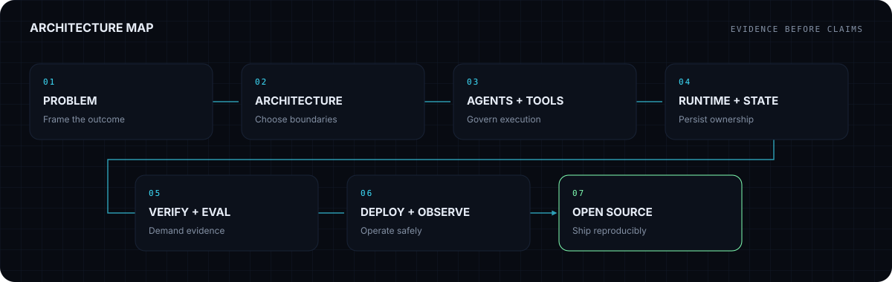

<a href="README.zh-CN.md">简体中文</a>

<picture>
  <source media="(prefers-color-scheme: dark)" srcset="assets/generated/hero-dark.svg">
  <source media="(prefers-color-scheme: light)" srcset="assets/generated/hero-light.svg">
  
</picture>

  <a href="https://3-d-homepage.vercel.app/"><strong>Enter Spatial AI World</strong></a>
  &nbsp;·&nbsp;
  <a href="https://github.com/xxiaoxiong/MegaDeepagents"><strong>Explore MegaDeepagents</strong></a>
  &nbsp;·&nbsp;
  <a href="https://github.com/pulls?q=is%3Apr+author%3Axxiaoxiong"><strong>View Open-Source Work</strong></a>

## System Signature

| System | Operating evidence |
|---|---|
| **Governed Agent Runtime** | Task graphs, durable state, controlled tools, verification, recovery |
| **Local AI Infrastructure** | OpenAI-compatible gateways, model serving, observability, deployment |
| **Knowledge and RAG Systems** | Document pipelines, retrieval, evidence-aware review, local-first search |
| **Open-Source Engineering** | Reproducible systems, bilingual documentation, tests, CI, accepted PRs |

## Flagship Systems

### 01 / MegaDeepagents

> A governed, recoverable and observable multi-agent task runtime.

**Problem.** Multi-agent coding systems need durable ownership, controlled tools and verifiable completion instead of optimistic chat coordination.

**System / Architecture.** LangGraph root graph → TaskGraph/TaskBoard → parallel scheduler → DeepAgent workers → ArtifactStore → fail-closed Verifier → repair or replan.

**Evidence.**

- Single runtime shared by browser, API and CLI
- Versioned plan state and transactional execution state
- Stable agent sessions, Git worktrees and governed integration
- Python and frontend validation commands documented

[Repository](https://github.com/xxiaoxiong/MegaDeepagents) · [Live system](https://megadeepagents.vercel.app)

---

### 02 / NICHOLAS / SPATIAL AI WORLD

> A continuous Three.js world used as the information architecture for an engineering portfolio.

**Problem.** Conventional portfolio grids do not communicate systems thinking or create a memorable exploration path.

**System / Architecture.** Next.js shell → persistent React Three Fiber world → camera director → six spatial system zones → accessible HUD and deep links.

**Evidence.**

- Live Vercel deployment
- Six navigable spatial zones with real project links
- Local 3D assets with attribution
- Responsive controls and reduced-motion behavior

[Repository](https://github.com/xxiaoxiong/3DHomepage) · [Live system](https://3-d-homepage.vercel.app/)

---

### 03 / Awesome Multi-Agent Projects

> A bilingual, domain-first research directory of open-source multi-agent systems.

**Problem.** Agent project lists become stale, duplicate data and rarely explain coordination models or adoption trade-offs.

**System / Architecture.** Structured dataset → schema validation → deterministic bilingual README and Astro site → CI and link checks.

**Evidence.**

- 101 researched projects across 21 categories in the audited README
- Internal bilingual research pages
- One dataset generates README and site
- CI validates schema, rendering, types, tests, build and links

[Repository](https://github.com/xxiaoxiong/awesome-multi-agent-projects) · [Live system](https://awesome-multi-agent-projects-site.vercel.app)

## Open-Source Fieldwork

Only merged pull requests authored by
[`xxiaoxiong`](https://github.com/xxiaoxiong) in repositories owned by other
accounts are eligible. Empty or failed API responses never replace the
last-known-good cache.

| Repository / PR | Contribution | Field | State |
|---|---|---|---|
| [ZhuLinsen/daily_stock_analysis #2048](https://github.com/ZhuLinsen/daily_stock_analysis/pull/2048) | feat: 支持 TUSHARE_HTTP_URL 自定义 Tushare Pro 接入地址 | Finance | `MERGED` |
| [nexu-io/open-design #5826](https://github.com/nexu-io/open-design/pull/5826) | fix(i18n): localize BYOK provider titles to English | Frontend | `MERGED` |
| [ZhuLinsen/daily_stock_analysis #2049](https://github.com/ZhuLinsen/daily_stock_analysis/pull/2049) | fix: 外股代码映射到中文显示名时英文新闻相关性漏判 | Finance | `MERGED` |
| [nexu-io/open-design #5760](https://github.com/nexu-io/open-design/pull/5760) | fix(media): drop response_format for gpt-image-* on image edits | AI Gateway | `MERGED` |
| [nexu-io/open-design #5454](https://github.com/nexu-io/open-design/pull/5454) | fix(web): solid background for browser extraction error toast | Frontend | `MERGED` |
| [nexu-io/open-design #5145](https://github.com/nexu-io/open-design/pull/5145) | fix(daemon): filter transient ACP status events at persistence time | Infrastructure | `MERGED` |

## Architecture Map

<picture>
  <source media="(prefers-color-scheme: dark)" srcset="assets/generated/architecture-map-dark.svg">
  <source media="(prefers-color-scheme: light)" srcset="assets/generated/architecture-map-light.svg">
  
</picture>

## Capability Matrix

| Domain | Verified working vocabulary |
|---|---|
| **Agent Systems** | LangGraph root graphs and durable state · TaskGraph and transactional TaskBoard · Parallel scheduling and stable agent sessions · Tool policy, human approval, verification and repair |
| **AI Infrastructure** | vLLM and OpenAI-compatible model endpoints · LiteLLM gateway and request governance · Docker-based local and server deployment · Prometheus and Grafana observability |
| **Knowledge Systems** | RAG retrieval and document review pipelines · Hybrid full-text and vector search · Structured knowledge and memory workflows · Evidence-aware output and failure fallback |
| **Backend and Platform** | Python, FastAPI and asynchronous services · SQLite, PostgreSQL, MySQL and Alembic · SSE streaming and replayable event envelopes · API contracts, health checks and access control |
| **Product and Experience** | Vue 3 and TypeScript control surfaces · Next.js and Three.js spatial portfolio · Bilingual technical information architecture · Responsive and accessible interaction design |
| **Engineering Quality** | Fail-closed verification and explicit invariants · Unit, integration and generator tests · CI, deterministic generation and cached fallback · Documentation, deployment boundaries and licenses |

## Agent Swarm Contribution Map

<picture>
  <source media="(prefers-color-scheme: dark)" srcset="assets/generated/contribution-swarm-dark.svg">
  <source media="(prefers-color-scheme: light)" srcset="assets/generated/contribution-swarm-light.svg">
  
</picture>

The map is generated from GitHub's `contributionsCollection`. If that API is
unavailable, the repository keeps the last verified asset; a fresh repository
shows an explicit pending state rather than invented activity.

## Now Building

- Governed multi-agent runtime
- AI-assisted investment research workflows
- Local-first AI platform engineering

## Collaboration

**OPEN TO COLLABORATION**

Multi-agent runtime · Local AI platform · RAG and knowledge systems ·
Open-source engineering

[GitHub](https://github.com/xxiaoxiong) ·
[Spatial portfolio](https://3-d-homepage.vercel.app/) ·
[nicholas_daxiong@163.com](mailto:nicholas_daxiong@163.com)

This profile is generated from versioned YAML and verified GitHub API
data. Architecture, customization and audit notes live in
[`docs/`](docs/ARCHITECTURE.md).
