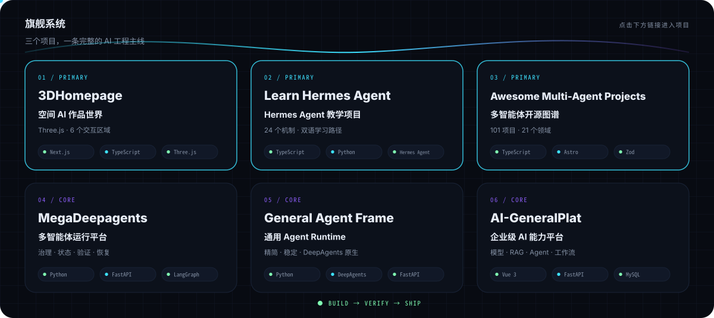
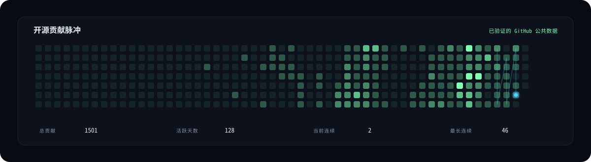

<a href="README.en.md"><kbd>English</kbd></a>

<picture>
  <source media="(prefers-color-scheme: dark)" srcset="assets/generated/hero-dark.svg">
  <source media="(prefers-color-scheme: light)" srcset="assets/generated/hero-light.svg">
  
</picture>

  <a href="https://github.com/xxiaoxiong/awesome-multi-agent-projects"><strong>🧭 浏览多智能体图谱</strong></a>
  &nbsp;&nbsp;·&nbsp;&nbsp;
  <a href="https://github.com/xxiaoxiong/MegaDeepagents"><strong>⚙️ 查看旗舰运行时</strong></a>
  &nbsp;&nbsp;·&nbsp;&nbsp;
  <a href="https://3-d-homepage.vercel.app/"><strong>🌐 进入 3D 作品集</strong></a>

## 从这里开始

| 你的目标 | 推荐入口 | 你会看到什么 |
|---|---|---|
| **发现多智能体项目与技术选型** | [Awesome Multi-Agent Projects](https://github.com/xxiaoxiong/awesome-multi-agent-projects) | 双语、按场景分类的多智能体开源项目图谱 |
| **评估我的工程深度** | [MegaDeepagents](https://github.com/xxiaoxiong/MegaDeepagents) | 可治理、可恢复、可验证的多智能体任务运行时 |
| **快速了解我的作品** | [3DHomepage](https://github.com/xxiaoxiong/3DHomepage) | 可交互的 3D AI 工程作品集 |

> 如果其中一个项目对你有帮助，欢迎在对应仓库点一个 Star；问题、使用反馈和改进建议也非常欢迎。

## 核心项目 · 完整矩阵

<picture>
  <source media="(prefers-color-scheme: dark)" srcset="assets/generated/project-showcase-dark.svg">
  <source media="(prefers-color-scheme: light)" srcset="assets/generated/project-showcase-light.svg">
  
</picture>

| [**01 · 3DHomepage**](https://github.com/xxiaoxiong/3DHomepage) | [**02 · Learn Hermes Agent**](https://github.com/xxiaoxiong/learn-hermes-agent) | [**03 · Awesome Multi-Agent Projects**](https://github.com/xxiaoxiong/awesome-multi-agent-projects) |
|:---:|:---:|:---:|
| [**04 · MegaDeepagents**](https://github.com/xxiaoxiong/MegaDeepagents) | [**05 · General Agent Frame**](https://github.com/xxiaoxiong/general-agent-frame) | [**06 · AI-GeneralPlat**](https://github.com/xxiaoxiong/AI-GeneralPlat) |

## 能力轨道

<picture>
  <source media="(prefers-color-scheme: dark)" srcset="assets/generated/capability-orbit-dark.svg">
  <source media="(prefers-color-scheme: light)" srcset="assets/generated/capability-orbit-light.svg">
  
</picture>

## 开源脉冲

<picture>
  <source media="(prefers-color-scheme: dark)" srcset="assets/generated/contribution-swarm-dark.svg">
  <source media="(prefers-color-scheme: light)" srcset="assets/generated/contribution-swarm-light.svg">
  
</picture>

<strong>查看已合并的外部开源贡献</strong>

| 仓库 / PR | 贡献 | 领域 |
|---|---|---|
| [ZhuLinsen/daily_stock_analysis #2140](https://github.com/ZhuLinsen/daily_stock_analysis/pull/2140) | ci(#2131): 给 backend-gate offline pytest 加 --timeout=120 + faulthandler_timeout=300 watchdog | Testing |
| [ZhuLinsen/daily_stock_analysis #2050](https://github.com/ZhuLinsen/daily_stock_analysis/pull/2050) | fix(#1970): 关闭认证强制要求当前管理员密码二次确认 | Engineering |
| [ZhuLinsen/daily_stock_analysis #2109](https://github.com/ZhuLinsen/daily_stock_analysis/pull/2109) | fix(longbridge): 修正 history_candlesticks_by_offset 位置参数顺序，导致 volume_ratio 静默失败 (fixes #2100) | Engineering |
| [nexu-io/open-design #5825](https://github.com/nexu-io/open-design/pull/5825) | fix(ui): improve dark-mode contrast for off-state toggles | Frontend |

## 联系我

  <strong>多智能体系统 · 本地 AI 平台 · RAG / 知识工程 · 企业 AI 应用</strong>

  <a href="mailto:nicholas_daxiong@163.com">📮 nicholas_daxiong@163.com</a>
  &nbsp;&nbsp;·&nbsp;&nbsp;
  <a href="https://github.com/xxiaoxiong">GitHub</a>
  &nbsp;&nbsp;·&nbsp;&nbsp;
  <a href="https://3-d-homepage.vercel.app/">3D Portfolio</a>

内容由版本化数据与 GitHub 公共 API 生成；动态 SVG 支持减少动态效果偏好。

